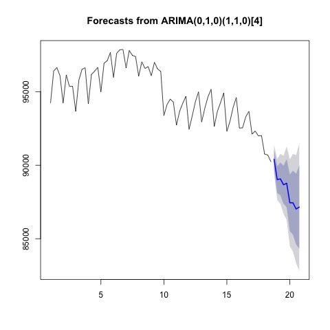
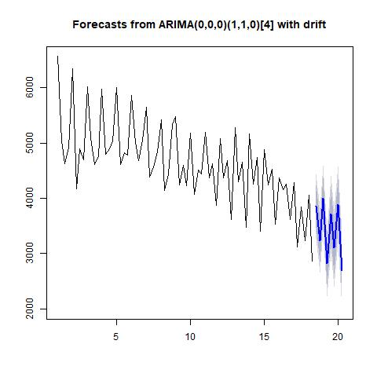
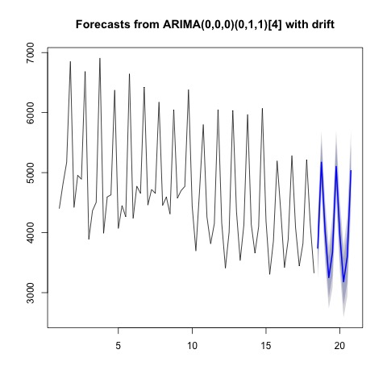

# Business Data Science Challenge 2019

## Introduction
In this problem, we are given the dataset consists of firms in 19 different industries across 5 areas in Canada, our objective is to discover the business trend and determine the business cycle over time.  In order to quantify the business dynamics measures, five variables are introduced. 
Meanwhile, Entry and exit are based on an annual definition whereas openings and closings are based on the quarterly definition.  Both annual based and quarterly based data have their own advantages, the quarterly based measurements update more frequently so that they provide immediate observations of the economy.  Although the annually based measurements update less frequently, these data are more robust and reveal a long term performance of the economy.  
By examing the data, we noticed data entries are recorded quarterly starting from 2000 Q1 to 2017 Q3.  It is obvious that these data form a time series because data entries are highly correlated, a traditional linear model is not applicable due to the violation of the assumption of independence.  Therefore, we decide to use ARIMA(a specific time series model) model to forecast five variables mentioned above.  

## Methodology

### Times Series Analysis
To do the predictions, we decided to apply the seasonal ARIMA model to model our data. For each province's each variable, depending on the behavior of our information set, a S-ARIMA model with optimal parameters will be selected to do the modeling. The optimal parameters for each model will be selected using R-function auto.arima, by choosing the parameters to correspond to the lowest Akaike Information Criterion. Also, auto.arima will also select the appropriate order for integration if the time series is non-stationary. Based on our fitted S-ARIMA models, we will be able to do the forecast for future values of those variables such as Entry and Exit for each province, and we will also be able to construct a prediction interval for each future value.
To be more specific, basically, we divided the data set into 95 different subsets based on provinces and industries. Then we will train our model and do the forecast for each province's each industry. Then depending on whether the time series data shows a signal of a stochastic trend, the auto.arima function will decide to difference our times series for several times or not, to make the time series stationary. For some subsets of our data, there may exist a signal of the seasonal pattern in the time series, then the auto.arima function will select appropriate seasonal orders for AR and MA parts of our model, which will take into account the seasonality in our time series. For each optimal S-ARIMA model selected by the function auto.arima, we can then forecast the values up to the fourth quarter in 2019.
### ANOVA

### Poisson Regression

## Statistical Results

**Following are some predictions generate from ARIMA model, visit our GitHub repo for full result.**

### Some Tables and Forms

  
| Geography | Industry | 2017_Q4 | 2018_Q1 | 2018_Q2 | 2018_Q3 | 2018_Q4 | 2019_Q1 | 2019_Q2 | 2019_Q3 | 2019_Q4 |  
|:----------|:---------|---:|---:|---:|---:|---:|---:|---:|---:|  
|    CA     |    44-45    |90401|89020|89069|88667|88773||87445|87018|87152|  
|    BC     |    44-45    |13220|12875|12840|12788|12939|12594|12559|12507|12657|  
|    ON     |    44-45    |33075|32362|32563|32586|33098|32285|32450|32429|32960|  
|    QC     |    44-45    |21430|21048|21120|21093|21128|20644|20669|20646|20703|  
|    AB     |    44-45    |10364|10190|10125|10071|10210|10035|9971|9917|10056|  

  

This table represents prediction of the number of active companies in retail industry for each area.

  
| Geography | Industry | 2017_Q4 | 2018_Q1 | 2018_Q2 | 2018_Q3 | 2018_Q4 | 2019_Q1 | 2019_Q2 | 2019_Q3 | 2019_Q4|
|:----------|:---------|---:|---:|---:|---:|---:|---:|---:|---:|
|    AB     |   48-49    |127|135|150|147|149|156|166|166|168|
|    BC     |   48-49    |135|118|158|192|160|131|164|196|161|
|    CA     |   48-49    |879|761|1063|1068|944|800|1087|1082|952|
|    ON     |    48-49    |435|288|494|427|467|295|471|393|452|
|    OC    |    48-49    |87|54|111|122|78|38|85|94|60|
e
  
 

### Some Visual Results

**Number of active firms for retail industry in Canada**  
  
**Number of openning firms for retail industry in Canada**   
 
**Number of closing firms for retail industry in Canada**  
   

### Explaination for retail industry  
For example, consider the retailing industry(44-45), we observed that the number of active companies declines over time.  Around 2010, there is a sharp decline in the retail industry, it then fluctuates for a while until another sharp decline around 2016.  Based on the previous trend of this industry, our time series model predicts(blue part) further declining in this industry.  In order to explain this scenario,  we need to examine the number of opening firms and the number of closing firms.  According to the number of opening firms, it is evident there is a significant declining trend in the number of new companies.  Unlikely, the number of closing firms is consistent on average and has a minor declining trend.  Since fewer companies enter and a similar number of companies quit, the overall number of active firms is shrinking and this matches our model's prediction.  

## Conclusions
