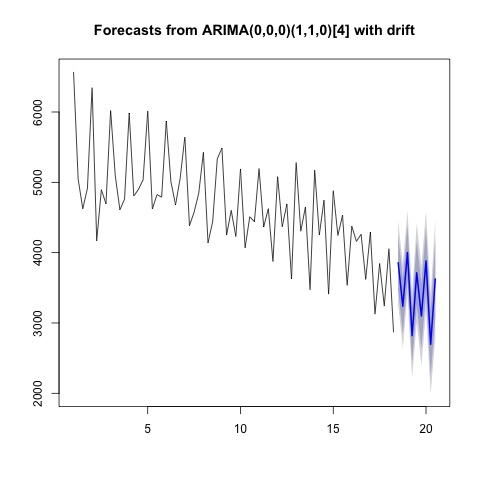
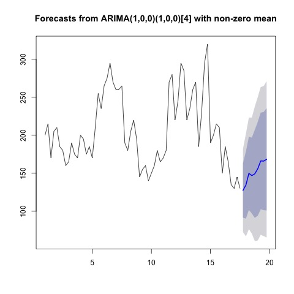
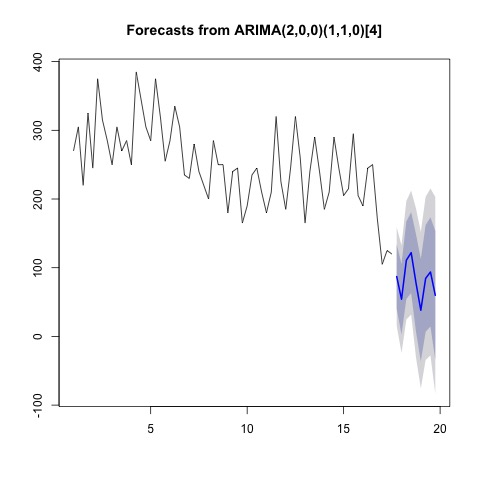

# Business Data Science Challenge 2019

## Introduction

In this problem, we are given the dataset consists of firms in 19 different industries across 5 areas in Canada, our objective is to discover the business trend and determine the business cycle over time.  In order to quantify the business dynamics measures, five variables are introduced. 
Meanwhile, Entry and exit are based on an annual definition whereas openings and closings are based on the quarterly definition.  Both annual based and quarterly based data have their own advantages, the quarterly based measurements update more frequently so that they provide immediate observations of the economy.  Although the annually based measurements update less frequently, these data are more robust and reveal a long term performance of the economy.  
By examing the data, we noticed data entries are recorded quarterly starting from 2000 Q1 to 2017 Q3.  It is obvious that these data form a time series because data entries are highly correlated, a traditional linear model is not applicable due to the violation of the assumption of independence.  Therefore, we decide to use ARIMA(a specific time series model) model to forecast five variables mentioned above.  

## Methodology

### Times Series Analysis

To do the predictions, we decided to apply the seasonal ARIMA model to model our data. For each province's each variable, depending on the behavior of our information set, a S-ARIMA model with optimal parameters will be selected to do the modeling. The optimal parameters for each model will be selected using R-function auto.arima, by choosing the parameters to correspond to the lowest Akaike Information Criterion. Also, auto.arima will also select the appropriate order for integration if the time series is non-stationary. Based on our fitted S-ARIMA models, we will be able to do the forecast for future values of those variables such as Entry and Exit for each province, and we will also be able to construct a prediction interval for each future value.  
To be more specific, basically, we divided the data set into 95 different subsets based on provinces and industries. Then we will train our model and do the forecast for each province's each industry. Then depending on whether the time series data shows a signal of a stochastic trend, the auto.arima function will decide to difference our times series for several times or not, to make the time series stationary. For some subsets of our data, there may exist a signal of the seasonal pattern in the time series, then the auto.arima function will select appropriate seasonal orders for AR and MA parts of our model, which will take into account the seasonality in our time series. For each optimal S-ARIMA model selected by the function auto.arima, we can then forecast the values up to the fourth quarter in 2019.

## Statistical Results

### Some Tables and Forms

This table represents prediction of the number of active companies in retail industry for each area. 
  
| Geography | Industry | 2017_Q4 | 2018_Q1 | 2018_Q2 | 2018_Q3 | 2018_Q4 | 2019_Q1 | 2019_Q2 | 2019_Q3 | 2019_Q4 |  
|:----------|:---------|--------:|--------:|--------:|--------:|--------:|--------:|--------:|--------:|--------:|  
|    CA     |  44-45   |    90401|    89020|    89069|    88667|    88773|    87444|    87445|    87018|    87152|  
|    BC     |  44-45   |    13220|    12875|    12840|    12788|    12939|    12594|    12559|    12507|    12657|  
|    ON     |  44-45   |    33075|    32362|    32563|    32586|    33098|    32285|    32450|    32429|    32960|  
|    QC     |  44-45   |    21430|    21048|    21120|    21093|    21128|    20644|    20669|    20646|    20703|  
|    AB     |  44-45   |    10364|    10190|    10125|    10071|    10210|    10035|     9971|     9917|    10056|  

This table represents prediction of the number of companies'entries in transportation and warehousing industry for each area.
  
| Geography | Industry | 2017_Q4 | 2018_Q1 | 2018_Q2 | 2018_Q3 | 2018_Q4 | 2019_Q1 | 2019_Q2 | 2019_Q3 | 2019_Q4 |  
|:----------|:---------|--------:|--------:|--------:|--------:|--------:|--------:|--------:|--------:|--------:| 
|    CA     |   48-49  |      879|      761|     1063|     1068|      944|      800|     1087|     1082|      952|
|    AB     |   48-49  |      127|      135|      150|      147|      149|      156|      166|      166|      168|
|    BC     |   48-49  |      135|      118|      158|      192|      160|      131|      164|      196|      161|
|    ON     |   48-49  |      435|      288|      494|      427|      467|      295|      471|      393|      452|
|    OC     |   48-49  |       87|       54|      111|      122|       78|       38|       85|       94|       60|

To view more predicted data, please visit [https://github.com/carlonlv/Data-Challenge-2019/tree/master/tables](https://github.com/carlonlv/Data-Challenge-2019/tree/master/tables).

### Some Visual Results

For the plots presented below, we have the number of companies as the y-axis and the number of quarters since Q1 of 2000 as the x-axis. The black fraction of the trend represents the data provided and the blue fraction represents the trend predicted using our statistical models. The grey area represents the variability of our predictions, we are 95% confident that the true value lies within this region.  

**Number of active firms for retail industry in Canada**  
  
From this plot, we can see that there exists a obvious downward trend in our time series. Therefore auto.arima decides to difference our time series for once to make it stationary. Based on this model, we predict that the number of active firms in retail industry in Canada will decline rapidly in the next few quaters.   

**Number of openning firms for retail industry in Canada**   
  
In this plot, we can detect that there exists obvious downward trend and strong seasonalities. Therefore auto.arima differences the time series for once and put a seasonal component into the model. Based on this model, we predict that the number of openning firms in retail industry in Canada will decline gradually and keep oscillating in the next few quaters.  

**Number of closing firms for retail industry in Canada**  
   
From this plot, we notice that in this time series plot, there exists no obvious trend but exists strong seasonalities. Furthermore, the violatility is quite large overall. Therefore auto.arima puts a seasonal component into the model without differencing the time series too much. Based on this model, we predict the number of closing firms in retail industry in Canada will keep oscillating in the next few quaters but stay the same on average.  

**Number of entry firms for transport and warehousing industry in AB**  
  
In this plot, we find that the time series looks pretty much like a stationary process. Consequently, auto.arima does not difference our time series, but directly combine a AR(1) model with a S-AR(1) model to fit our data. Based on this combined model, we predict that number of entry firms for transport and warehousing industry in AB province will increase smoothly in the next few quarters.  

**Number of entry firms for transport and warehousing industry in QC**  
    

From this plot, we can see that this time series originally looks very stationary, but beginning at 2016, it has a sudden drop in the number of companies. Therefore, auto.arima function combines a AR(2) with a S-ARIMA(1,1,0) to fit our data. Based on this model, we predict that in the next few quarters, the decline will gradually stabilize, but it may keep oscillating.  

To view more visual results, please visit [https://github.com/carlonlv/Data-Challenge-2019/tree/master/plots](https://github.com/carlonlv/Data-Challenge-2019/tree/master/plots).

### Explaination for retail industry  
For example, consider the retailing industry(44-45), we observed that the number of active companies declines over time.  Around 2010, there is a sharp decline in the retail industry, it then fluctuates for a while until another sharp decline around 2016.  Based on the previous trend of this industry, our time series model predicts(blue part) further declining in this industry.  
In order to explain this scenario,  we need to examine the number of opening firms and the number of closing firms.  According to the number of opening firms, it is evident there is a significant declining trend in the number of new companies.  Unlikely, the number of closing firms is consistent on average and has a minor declining trend.  Since fewer companies enter and a similar number of companies quit, the overall number of active firms is shrinking and this matches our model's prediction.  

## Conclusions
